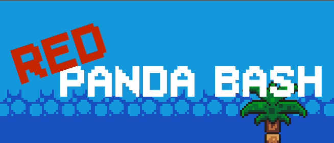

# 🐼 Red Panda Bash

A fast-paced platformer arcade game built with Godot Engine and GDScript. In **Red Panda Bash**, you play as a skilled red panda dodging obstacles and launching bamboo attacks in frantic duels against rivals.

## 🎮 Play the Game

🌐 [Play on Itch.io](https://cents808.itch.io/red-panda-bash)

## 📸 Preview

 <!-- Replace with an actual GIF or screenshot if available -->

## ✨ Features

- Tight, responsive 2D platformer mechanics
- Unique bash-and-throw combat system
- Arcade-style dueling action
- Hand-crafted animations and pixel art
- Built in the Godot Engine using GDScript

## 🛠️ Built With

- **Godot Engine**
- **GDScript**
- **PiskelApp (for pixel art)**

## 🧠 Inspiration

Designed as a fun twist on classic arcade brawlers, this project explores clean movement, attack timing, and matchups in a minimalist setting.

## 🙋‍♂️ Author

**Vincent Nguyen**  
🎮 Game Designer & Developer  
🔗 [Portfolio Website](https://vincentnguyen.vercel.app/)  
🐙 [@vincent-huu-nguyen](https://github.com/vincent-huu-nguyen)

---
